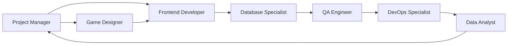
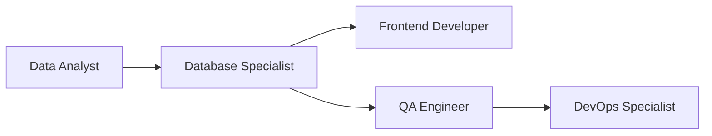
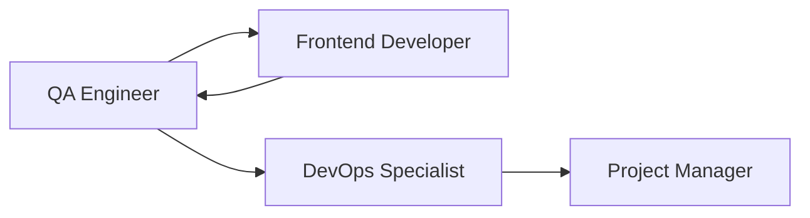

# Guia de AI Agents - Gubi App

Este diretório contém agentes especializados### 📊 **Data Analyst**
- ✅ Processando eventos comportamentais
- ✅ Gerando Relatórios de Potencial personalizados
- ✅ Monitorando métricas de engajamento (D0/D1, D7/D30)
- ✅ Analisando padrões para otimização

### 🗄️ **Database Specialist**
- ✅ Modelando estrutura de dados do PRD (seção 9)
- ✅ Otimizando consultas para Relatórios de Potencial
- ✅ Implementando conformidade LGPD (auditoria, segregação)
- ✅ Garantindo integridade referencial entre entidades desenvolvimento da plataforma gamificada Gubi. Cada agente representa uma função específica com responsabilidades, ferramentas e fluxos claramente definidos.

## 📋 Índice de Agentes

| Agente | Função | Quando Usar |
|--------|--------|-------------|
| [🧑‍💼 Project Manager](Project_Manager.md) | Coordenação de projeto | Planejamento, priorização, aprovação de entregas |
| [🎨 Frontend Developer](Frontend_Developer.md) | Desenvolvimento de interface | Implementação de componentes, gamificação, acessibilidade |
| [🧪 QA Engineer](QA_Engineer.md) | Garantia de qualidade | Testes, validação de critérios, performance |
| [🛠️ DevOps Specialist](DevOps_Specialist.md) | Infraestrutura e deploy | CI/CD, monitoramento, segurança, LGPD |
| [🎮 Game Designer](Game_Designer.md) | Mecânicas de gamificação | Atividades interativas, sistema de recompensas |
| [📊 Data Analyst](Data_Analyst.md) | Análise comportamental | Relatórios de potencial, métricas, insights |
| [🗄️ Database Specialist](Database_Specialist.md) | Arquitetura de dados | Modelagem, performance, integridade, LGPD |

## 🚀 Como Usar Este Guia

### 1. **Cenário: Nova Funcionalidade**
```
1. Project Manager → Define escopo baseado no PRD
2. Game Designer → Especifica mecânicas (se gamificada)
3. Frontend Developer → Implementa interface
4. QA Engineer → Valida critérios de aceite
5. DevOps Specialist → Deploy e monitoramento
6. Data Analyst → Analisa impacto nas métricas
```

### 2. **Cenário: Bug Reportado**
```
1. QA Engineer → Reproduz e documenta o problema
2. Frontend Developer → Implementa correção
3. QA Engineer → Valida a correção
4. DevOps Specialist → Deploy da correção
```

### 3. **Cenário: Otimização de Performance**
```
1. Data Analyst → Identifica gargalos nas métricas
2. Database Specialist → Otimiza queries e índices
3. Frontend Developer → Otimiza código e componentes
4. QA Engineer → Valida tempos de carregamento (≤ 3s/6s)
5. DevOps Specialist → Monitora performance pós-deploy
```

### 4. **Cenário: Implementação de Nova Entidade de Dados**
```
1. Data Analyst → Define requisitos de dados comportamentais
2. Database Specialist → Modela schema e relacionamentos
3. Frontend Developer → Implementa interfaces que consomem dados
4. QA Engineer → Testa integridade e consistência
5. DevOps Specialist → Deploy com migração segura
```

## 🎯 Quando Usar Cada Agente

### 🧑‍💼 **Project Manager**
- ✅ Definindo prioridades do roadmap
- ✅ Aprovando entregas que impactam o PRD
- ✅ Mediando conflitos entre áreas técnicas
- ✅ Validando conformidade com personas do PRD

### 🎨 **Frontend Developer**
- ✅ Implementando jornada de onboarding (Steps 1-8)
- ✅ Desenvolvendo componentes de gamificação
- ✅ Garantindo acessibilidade WCAG 2.2 AA
- ✅ Otimizando para dispositivos modestos

### 🧪 **QA Engineer**
- ✅ Testando fluxos das 3 personas principais
- ✅ Validando critérios de aceite (CA-01 a CA-10)
- ✅ Auditando acessibilidade e performance
- ✅ Verificando geração do Relatório de Potencial

### 🛠️ **DevOps Specialist**
- ✅ Configurando pipelines de CI/CD
- ✅ Implementando monitoramento de métricas
- ✅ Garantindo conformidade LGPD
- ✅ Gerenciando secrets e variáveis de ambiente

### 🎮 **Game Designer**
- ✅ Criando atividades baseadas em psicologia
- ✅ Implementando mecânicas de recompensa
- ✅ Desenvolvendo algoritmos de recomendação
- ✅ Coletando eventos de jogo para análise

### �️ **Database Specialist**
- ✅ Modelando estrutura de dados do PRD (seção 9)
- ✅ Otimizando consultas para Relatórios de Potencial
- ✅ Implementando conformidade LGPD (auditoria, segregação)
- ✅ Garantindo integridade referencial entre entidades

## ⚡ Fluxos de Trabalho Integrados

### **Fluxo de Nova Feature**


### **Fluxo de Modelagem de Dados**


### **Fluxo de Bug Fix**


## 🔗 Referências Importantes

- **PRD**: `/docs/prd.md` - Requisitos funcionais (RF-01 a RF-13) e critérios de aceite
- **Diretrizes**: `/docs/CODE_GUIDELINES.md` - Padrões de desenvolvimento
- **Estrutura**: `/docs/PROJECT_STRUCTURE.md` - Organização do código
- **Contributing**: `/docs/CONTRIBUTING.md` - Processo de contribuição

## ⚠️ Regras de Ouro

1. **Sempre referencie o PRD** quando tomar decisões técnicas
2. **Teste nas 3 personas** (Jovem Explorador, Transição, Neurodivergente)
3. **Valide acessibilidade** em toda implementação
4. **Monitore performance** (≤ 3s rede boa, ≤ 6s rede fraca)
5. **Mantenha conformidade LGPD** em coleta/processamento de dados

---

> 💡 **Dica**: Este guia é vivo! Atualize conforme novos padrões e agentes sejam criados. Sempre confira a documentação em `/docs/` para detalhes atualizados.
