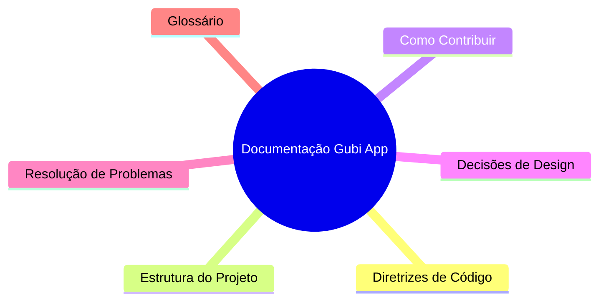

# README

Bem-vindo à documentação técnica da Gubi App!

Esta documentação existe para garantir que qualquer pessoa — de iniciantes a especialistas — possa entender, contribuir e manter o projeto de forma rápida e eficiente. Use este guia para encontrar padrões, decisões, estrutura e dicas práticas para começar a contribuir em até 1 hora.

## Sumário
- [Diretrizes de Código](CODE_GUIDELINES.md)
- [Estrutura do Projeto](PROJECT_STRUCTURE.md)
- [Como Contribuir](CONTRIBUTING.md)
- [Decisões de Design](DESIGN_DECISIONS.md)
- [Resolução de Problemas](TROUBLESHOOTING.md)
- [Glossário](GLOSSARY.md)

## Mapa Mental (Mermaid.js)

> Observação: Esta documentação reflete o estado atual do projeto em 18 de agosto de 2025. Sempre confira os arquivos-fonte para detalhes atualizados.
