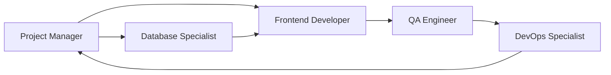

# Plano Estratégico: Visualização e Edição do Perfil do Usuário (`dashboard/profile`)

## Objetivo
Desenvolver uma página acessível via o botão "Meu Perfil" na rota `dashboard/profile` para visualização e edição dos dados do perfil do usuário, seguindo as diretrizes de código e fluxo de agentes da Gubi App.

---

## 1. Agente Principal
- **Frontend Developer**
  - Lidera a implementação da interface, integra APIs e garante acessibilidade.

## 2. Agentes Secundários
- **Project Manager**: Define escopo, aprova entregas e valida alinhamento com o PRD.
- **Database Specialist**: Modela/ajusta estrutura de dados e endpoints necessários.
- **QA Engineer**: Valida critérios de aceite, testes funcionais, acessibilidade e performance.
- **DevOps Specialist**: Garante deploy seguro, versionamento e monitoramento.

---

## 3. Etapas Sequenciais do Desenvolvimento

### 1. Planejamento e Especificação
- **Responsável:** Project Manager
- **Entradas:** PRD, requisitos de perfil, critérios de aceite
- **Saídas:** User Stories, critérios de aceite, wireframes (se necessário)

### 2. Modelagem e Ajuste de Dados
- **Responsável:** Database Specialist
- **Entradas:** User Stories, modelo atual de usuário
- **Saídas:** Esquema de dados atualizado, endpoints REST/GraphQL/documentação

### 3. Implementação da Interface
- **Responsável:** Frontend Developer
- **Entradas:** User Stories, endpoints/documentação, wireframes
- **Saídas:** Página `dashboard/profile`, componentes reutilizáveis, integração com API, validação de formulário, feedback visual

### 4. Testes e Validação
- **Responsável:** QA Engineer
- **Entradas:** Página implementada, critérios de aceite
- **Saídas:** Relatórios de bugs, checklist de acessibilidade, testes automatizados (unitários/e2e)

### 5. Deploy e Monitoramento
- **Responsável:** DevOps Specialist
- **Entradas:** Código aprovado, testes validados
- **Saídas:** Deploy em ambiente de staging/produção, monitoramento de erros e performance

---

## 4. Entradas e Saídas Esperadas de Cada Agente

| Agente              | Entradas                                 | Saídas                                    |
|---------------------|------------------------------------------|-------------------------------------------|
| Project Manager     | PRD, requisitos, feedback dos agentes    | User Stories, critérios de aceite         |
| Database Specialist | User Stories, modelo atual               | Esquema/Endpoints/documentação            |
| Frontend Developer  | User Stories, endpoints, wireframes      | Código da página, integração, feedback UI |
| QA Engineer         | Página implementada, critérios de aceite | Relatórios de bugs, testes automatizados  |
| DevOps Specialist   | Código aprovado, testes                  | Deploy, monitoramento                     |

---

## 5. Pontos de Validação e Coordenação
- **Kickoff:** Reunião inicial entre Project Manager e todos os agentes para alinhamento.
- **Revisão de API:** Frontend e Database Specialist validam contratos de dados.
- **Code Review:** Frontend Developer e QA Engineer revisam código e testes.
- **Validação Final:** QA Engineer valida critérios de aceite e acessibilidade.
- **Go/No-Go:** Project Manager aprova para deploy.

---

## 6. Artefatos a Serem Produzidos
- Código-fonte da página `dashboard/profile` e componentes
- Documentação de endpoints e modelo de dados
- Testes automatizados (unitários/e2e)
- Checklist de acessibilidade
- Relatórios de bugs e validação
- Registro de deploy e monitoramento

---

## 7. Observações e Boas Práticas
- Seguir padrões definidos em `/docs/CODE_GUIDELINES.md` e `/docs/PROJECT_STRUCTURE.md`
- Garantir responsividade e acessibilidade (WCAG 2.2 AA)
- Validar LGPD para dados sensíveis
- Documentar decisões e endpoints

---

## 8. Estrutura Sugerida do Fluxo

---

> Este plano deve ser revisado e atualizado conforme surgirem novos requisitos ou mudanças no PRD.
